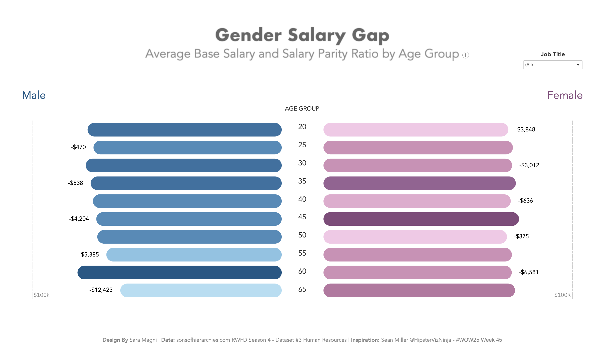

# Gender Salary Gap Pyramid | Interactive Data Viz

An **interactive Tableau dashboard** visualizing gender pay disparities across age groups using population pyramid design.

## Project Overview

This case study project analyzes gender-based salary gaps using a synthetic HR dataset, presenting the findings through an intuitive, interactive population pyramid visualization. The dashboard enables HR professionals and analysts to identify pay equity issues across different age demographics and job roles.

### Key Features

- **Population Pyramid Visualization**: Dual-sided horizontal bar chart comparing male and female salaries by age group
- **Interactive Filtering**: Dynamic job title filter for role-specific salary analysis
- **Detailed Tooltips**: Hover functionality displaying average salaries, pay parity ratios, and absolute differences
- **Color-Coded Insights**: Darker shading highlights age groups with larger pay disparities
- **Comprehensive Metrics**: Shows both absolute salary gaps and percentage-based pay parity ratios

## Data Source

**Dataset**: [Sons of Hierarchies RWFD Season 4 - Dataset #3 Human Resources](https://sonsofhierarchies.com/2025/10/01/rwfd-season-4-dataset-3-human-resources/)

The HR dataset contains 1.993 employee records with the following key attributes:
- Employee demographics (Gender, Age, Ethnicity)
- Compensation data (Base Salary, Bonus Eligibility)
- Employment details (Job Title, Department, Tenure)
- Performance metrics (Performance Rating, High Performer Flag)
- Work arrangements (Remote/Onsite, Full-Time/Part-Time)

## Tools & Technologies

- **Tableau Desktop** - Data visualization and dashboard creation
- **Python/Jupyter Notebook** - Data preprocessing and documentation
- **CSV** - Data format

## Interactive Dashboard (Tableau Public)

*Click the image above to explore the interactive viz.*
### Inspiration

This dashboard was inspired by [Sean Miller's Week 45 challenge](https://public.tableau.com/app/profile/hipstervizninja/viz/WOW202545_17623721140240/WOW202545PopulationPyramids) focusing on population pyramid visualizations.

### Design Principles

1. **Diverging Bar Chart**: Males on the left (blue), females on the right (pink)
2. **Age Group Segmentation**: Ages 20-65 in 5-year increments
3. **Salary Differential Labels**: Clear display of pay gaps for each age bracket
4. **Dynamic Color Intensity**: Darker shades indicate larger disparities
5. **Contextual Information**: Tooltips provide detailed salary breakdowns and ratios

### Getting Started

#### Prerequisites

- Tableau Desktop 2021.1 or later
- Access to the synthetic HR dataset (included in repository)

#### Installation & Usage

1. **Clone the repository**

2. **Open in Tableau**

3. **Explore the Dashboard**
   - Use the Job Title filter to analyze specific roles
   - Hover over bars to see detailed salary information
   - Compare pay gaps across different age groups

### Dashboard Components

#### Main Visualization
- **Left Side (Male)**: Blue bars showing average male salaries by age group
- **Right Side (Female)**: Pink bars showing average female salaries by age group
- **Center Labels**: Absolute salary differences between genders
- **Age Group Axis**: 5-year age brackets from 20 to 65

#### Interactive Elements
- **Job Title Filter**: Dropdown menu to filter by specific job roles
- **Tooltips**: Display average base salaries, salary ratios, and pay parity percentages
- **Color Gradients**: Visual encoding of pay gap magnitude

## Methodology

1. **Data Preparation**: Filtered active employees and calculated gender-based salary averages
2. **Age Grouping**: Segmented employees into 5-year age brackets
3. **Gap Calculation**: Computed absolute and percentage-based salary differences
4. **Visualization Design**: Implemented population pyramid structure with diverging bars
5. **Interactivity**: Added filters and tooltips for deeper analysis

## Author

**Sara Magni**  
*Data Analyst*

[sara.m4gn1.data@gmail.com](mailto:sara.m4gn1.data@gmail.com) | [LinkedIn](https://www.linkedin.com/in/sara-m4gn1/) | [GitHub](https://github.com/Sara-Magni)

## Acknowledgments

- [Sons of Hierarchies](https://sonsofhierarchies.com/) for providing the synthetic HR dataset
- [Sean Miller (@HipsterVizNinja)](https://public.tableau.com/app/profile/hipstervizninja) for the population pyramid visualization inspiration

---

**Note**: This dashboard uses synthetic data and is intended for educational and analytical demonstration purposes only. All employee records are fictitious and do not represent any real organization.
